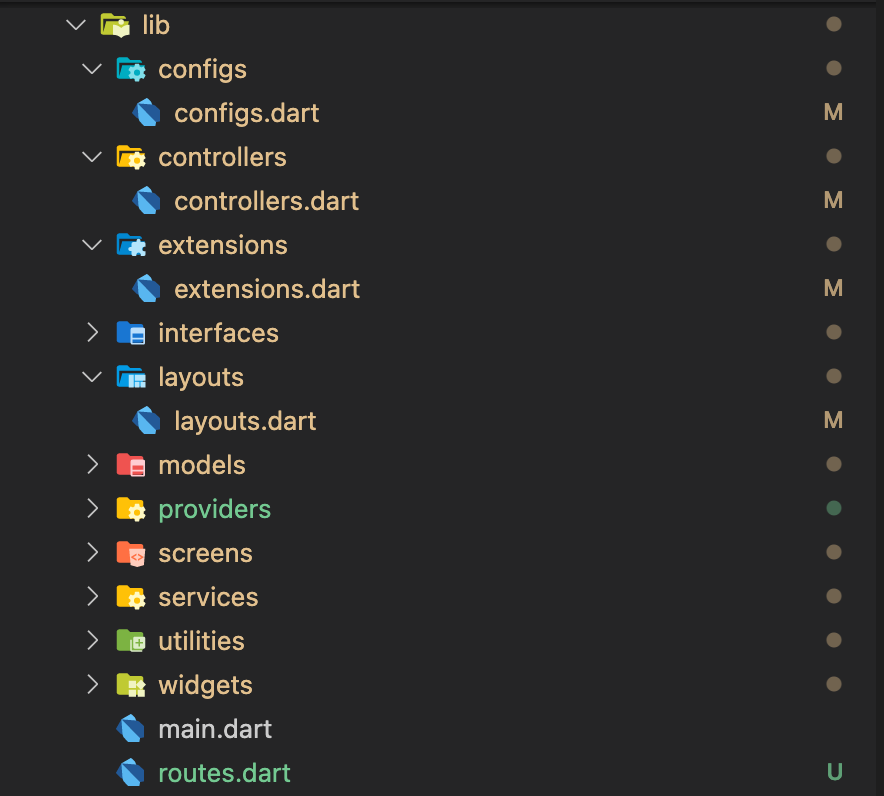
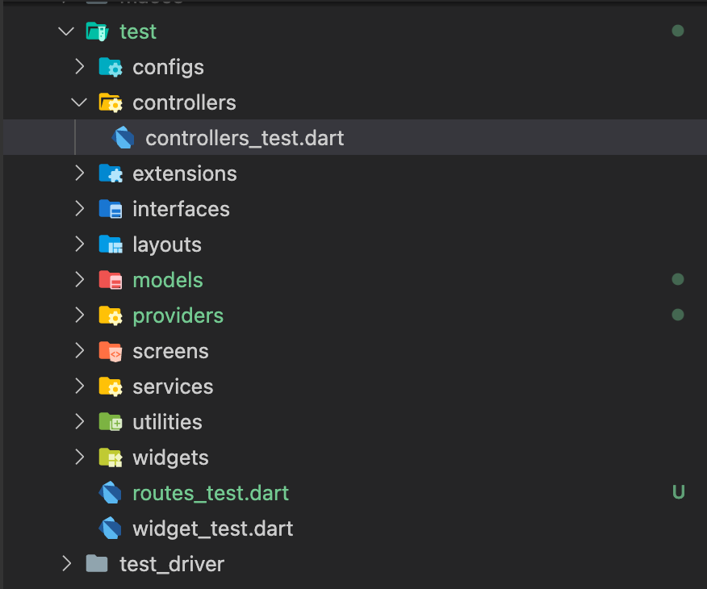

Welcome to Myst

please check out the packages directory to see the available dart package in myst cli package.

### screenshots

* lib directory

* asset directory

* test directory

* integration_test directory


please make sure you have dart installed your marchine correctly

### Getting start
```
dart pub global activate myst
```
Or Use this package as a library
Run this command:

With Dart:
```
dart pub add myst
```
With Flutter:
```
flutter pub add myst
```

### Available commands

| commands  | alias | description |
| ------------- | ------------- | ------------- |
| `myst init`  | `i`| <font color="green">✔</font> generate a structure of flutter application   |
| `myst model`  | `m`| <font color="green">✔</font> create a file in lib/models and test/models   |
| `myst controller`  | `c`| ❌ create a file in lib/controllers and test/controllers   |
| `myst provider`  | `p`| ❌ create a file in lib/providers and test/providers   |
| `myst extension`  | `e`| ❌ create a file in lib/extensions and test/extensions   |
| `myst layout`  | `l`| ❌ create a file in lib/layouts and test/layouts   |
| `myst service`  | `s`| ❌ create a file in lib/services and test/services   |
| `myst util`  | `u`| ❌ create a file in lib/utilities and test/utilities   |
| `myst widget`  | `w`| ❌ create a file in lib/widgets and test/widgets   |
| `myst screen`  | `s`| ❌ create a file in lib/screens and test/screens   |
| `myst interface`  | `if`| ❌ create a file in lib/interfaces and test/interfaces   |
| `myst config`  | `cf`| ❌ create a file in lib/configs and test/configs   |


### Arguments
| arguments  | alias | description |
| ------------- | ------------- | ------------- |
| --help  | -h | show the usage information |
| --name  | -name | set the new file name (optional) |


## Ideas
If you have any idea please let me know, I will consider for contributing