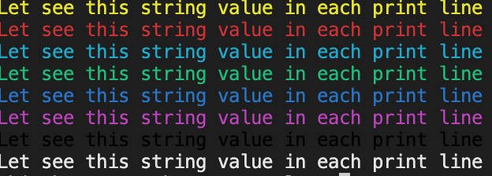

PrintX will allow you to print any object in colorize



## Features

function to print the object in different color

```dart
printBlue(Object? object)

printRed(Object? object)

printGreen(Object? object)

printCyan(Object? object)

printYellow(Object? object)

printBlack(Object? object)

printWhite(Object? object)
```

or

```dart
PrintX.warn(object);

PrintX.error(object);

PrintX.cool(object);

PrintX.sucess(object);

PrintX.info(object);

PrintX.fatal(object);

PrintX.hide(object);

PrintX.debug(object);
```

or shortcut

```dart
PrintX.w(object);

PrintX.e(object);

PrintX.c(object);

PrintX.s(object);

PrintX.i(object);

PrintX.f(object);

PrintX.h(object);

PrintX.d(object);
```

## Getting started

run in dart app
```
dart pub add printx
```
or in flutter app
```
flutter pub add printx
```

* pubspec.yaml

```yaml
dependencies:
    printx: any
```

* import
```
import 'package:printx/printx.dart';
```
